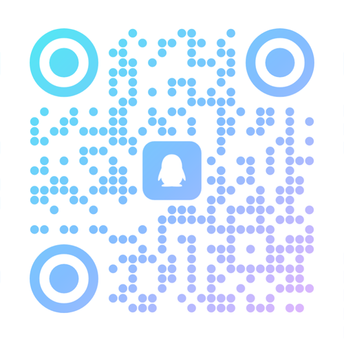

          
# 🌟 ComfyUI XnanTool 🌟

<div align="center">
  
  <p>🚀 提升你的 ComfyUI 图像生成体验！🚀</p>
</div>

## 📝 简介

**XnanTool**初心是一个为 ComfyUI 打造的市面上插件因原作者不更，或者更新慢，导致功能不足的问题，这里提供了拓展方案。

## ✨ 功能特性

### ✨ 中文翻译优化

为了提升中文用户的使用体验，XnanTool 对所有节点的标题、描述、输入输出参数等进行了全面的中文本地化优化：

- 📘 **节点标题优化**：所有节点都有清晰易懂的中文标题，如"魔搭API文生图节点"、"YOLO检测与裁剪一体化"等
- 📝 **参数描述优化**：每个输入参数都有详细的中文说明，帮助用户快速理解参数作用
- 🎯 **功能说明优化**：每个节点都有详细的中文功能描述，解释节点的具体用途和适用场景
- 🧩 **选项标签优化**：对于下拉菜单等选项，提供了直观的中文标签，如"最高置信度"、"手动索引"等
- 📋 **输出说明优化**：每个输出端口都有明确的中文标识，便于用户识别和使用

通过这些优化，即使是初次接触 ComfyUI 的中文用户也能快速上手并高效使用 XnanTool 的各项功能。

### 🤖 modelscope-魔搭社区api在comfyui调用
- 📚 内置多种常用大模型支持
- 🔍 可视化查看和管理可用模型
- ➕ 支持添加自定义模型到预设列表
- 💾 配置自动保存，方便下次使用

### 🎨 支持LoRA 模型调用- 
- 🚀 支持多种基础模型的文生图功能
- 🎭 集成 LoRA 模型加载和权重调整，无需下载
- 🌐 通过魔搭 API 调用模型，参数灵活自定义
- 🎯 精准控制生成效果，满足个性化需求

### 📏 尺寸预设功能
- 🖼️ 提供 AI 生图常用尺寸的快速选择
- 📐 支持多种模型的推荐尺寸（SD 1.5、SDXL、Qwen-Image、Flux等）
- � 每个尺寸都标注了精确的比例信息
- ⚡ 一键应用，省去手动计算烦恼

### 🎯 YOLO目标检测与分割
- 🚀 完整集成YOLOv8系列模型支持
- 🔍 精确的目标检测与分类功能
- ✂️ 强大的图像分割能力
- 🤖 YOLO与SAM模型结合，实现更精确的分割效果

### 🧠 SAM智能分割功能
- 🎯 精确的图像分割能力
- 🔄 支持多种SAM模型变体（vit_h/l/b）
- 🧩 与YOLO检测结合实现智能背景去除

### ⚙️ 智能安装与配置管理
- 🚀 一键安装脚本，简化依赖安装过程
- ✅ 自动验证功能，确保插件正确安装
- 📄 配置文件管理，保存用户偏好设置
- 🔄 支持多种安装方式（手动、ComfyUI Manager、脚本）

### 🎬 媒体处理功能
- 🎞️ 视频转GIF功能，支持自定义持续时间、帧率、缩放因子等参数
- 🎵 视频转音频功能，支持从视频中提取音频并保存为多种格式（MP3、WAV、AAC、FLAC）

### 🛠️ 实用工具扩展
- 🟦 长方形转换器，可将正方形图像转换为长方形图像，支持左右和上下方向扩展
- 🔀 切换值节点，支持在两个值之间动态切换，适用于多种数据类型
- 🖼️ 创建图像节点，可创建指定尺寸和颜色的图像，便于测试和占位

## 📥 安装方法

### 方法一：直接克隆
```bash
# 克隆仓库到 ComfyUI 的 custom_nodes 目录
git clone https://github.com/otsluo/comfyui-xnantool.git
# 安装依赖: pip install -r requirements.txt
# 重启 ComfyUI 即可使用
```
```bash
# 加速镜像
git clone https://gitcode.com/weixin_45738527/comfyui-xnantool.git
# 安装依赖: pip install -r requirements.txt
# 重启 ComfyUI 即可使用
```

### 方法二：手动安装
1. 💾 下载本项目的压缩包
2. 📂 将解压后的 `comfyui-xnantool` 文件夹复制到 ComfyUI 的 `custom_nodes` 目录中
3. 💻 安装依赖: `pip install -r requirements.txt`
4. 🔄 重启 ComfyUI 后即可在节点菜单中找到相关功能

### 方法三：使用安装脚本 (Windows推荐)
1. 🚀 打开命令提示符 (CMD) 或 PowerShell
2. 📁 切换到插件目录: `cd e:\git_project\comfyui-xnantool`
3. ▶️ 运行安装脚本: `python install_dependencies.py`
4. ✅ 验证安装: `python verify_installation_xnantool.py`
5. 🔄 重启 ComfyUI

### 方法四：通过 ComfyUI Manager 安装 (推荐)
1. 🧩 在 ComfyUI Manager 中搜索 `XnanTool`
2. 📦 点击安装并等待完成
3. 🔄 重启 ComfyUI
4. ✅ 安装完成后即可在节点菜单中找到相关功能

## 📋 节点列表

<details>
<summary>点击展开/收起节点列表</summary>

### 📏 尺寸预设(SizeSelector)
- **位置**: `XnanTool/预设`
- **功能**: 从预设列表中选择图像尺寸
- **输入**: 预设名称
- **输出**: 宽度(width)、高度(height)
- **适用场景**: 快速选择常用的图像尺寸预设

### 🎨 魔搭API文生图节点 (modelscopeLoraTextToImageNode)
- **位置**: `XnanTool/modelscope-api`
- **功能**: 使用魔搭API的LoRA模型生成图像
- **输入**: 提示词、API Token、基础模型、LoRA模型等
- **输出**: 生成的图像(image)
- **适用场景**: 快速生成高质量的LoRA风格图像

### 🖌️ 魔搭API图像编辑节点 (modelscopeLoraImageEditNode)
- **位置**: `XnanTool/modelscope-api`
- **功能**: 使用魔搭API的LoRA模型编辑图像
- **输入**: 图像、提示词、API Token、基础模型、LoRA模型等
- **输出**: 编辑后的图像(image)
- **适用场景**: 对现有图像进行LoRA风格编辑

### 🚀 YOLO模型加载器 (v8预设)(YoloModelLoader)
- **位置**: `XnanTool/YOLO`
- **功能**: 加载和配置YOLO目标检测模型
- **输入**: 模型名称、置信度阈值、IOU阈值、使用缓存选项等
- **输出**: YOLO模型(YOLO_MODEL)、模型信息(model_info)
- **适用场景**: 为检测任务准备YOLO模型

### 🚀 YOLO模型加载器V2(本地模型) (YoloModelLoaderV2)
- **位置**: `XnanTool/YOLO`
- **功能**: 加载本地YOLO模型文件
- **输入**: 本地模型、置信度阈值、IOU阈值、使用缓存选项等
- **输出**: YOLO模型(YOLO_MODEL)、模型信息(model_info)
- **适用场景**: 使用本地存储的YOLO模型文件

### 🚀 YOLO模型加载器(自定义路径) (YoloModelLoaderCustomPath)
- **位置**: `XnanTool/YOLO`
- **功能**: 从自定义路径加载YOLO模型
- **输入**: 模型完整路径、置信度阈值、IOU阈值、使用缓存选项等
- **输出**: YOLO模型(YOLO_MODEL)、模型信息(model_info)
- **适用场景**: 使用指定路径的YOLO模型文件

### 🎯 YOLO检测与裁剪一体化 (YoloDetectAndCropNode)
- **位置**: `XnanTool/YOLO`
- **功能**: 执行YOLO检测并裁剪图像
- **输入**: YOLO模型、图像、类别、置信度阈值、边界填充
- **输出**: 裁剪后的图像、检测结果、检测对象数量、裁剪信息、裁剪区域数量
- **适用场景**: 目标检测后自动裁剪感兴趣区域

### 🟦 正方形转换器-【新】 (SquareConverter)
- **位置**: `XnanTool/Image`
- **功能**: 将图像转换为正方形，保持图像比例不变
- **输入**: 图像(image)、边距(margin)、填充颜色(pad_color)
- **输出**: 正方形图像(image)、宽度(width)、高度(height)
- **适用场景**: 需要将非正方形图像转换为正方形，同时保持图像内容完整

### 🧠 SAM模型加载器（预设） (SamModelLoader)
- **位置**: `XnanTool/SAM`
- **功能**: 加载预设的SAM模型
- **输入**: 模型类型、自动下载、使用缓存选项等
- **输出**: SAM模型(SAM_MODEL)、模型信息(model_info)
- **适用场景**: 使用预设的SAM模型进行图像分割

### 🧠 SAM模型加载器V2 (本地模型) (SamModelLoaderV2)
- **位置**: `XnanTool/SAM`
- **功能**: 加载本地SAM模型文件
- **输入**: 模型文件、使用缓存选项等
- **输出**: SAM模型(SAM_MODEL)、模型信息(model_info)
- **适用场景**: 使用本地存储的SAM模型文件

### 🧠 SAM模型加载器(自定义路径) (SamModelLoaderCustomPath)
- **位置**: `XnanTool/SAM`
- **功能**: 从自定义路径加载SAM模型
- **输入**: 模型完整路径、使用缓存选项等
- **输出**: SAM模型(SAM_MODEL)、模型信息(model_info)
- **适用场景**: 使用指定路径的SAM模型文件

### 🤖 魔搭API模型选择器 (ModelscopeApiSelector)
- **位置**: `XnanTool/预设`
- **功能**: 选择魔搭API模型
- **输入**: 模型名称
- **输出**: 模型名称(model_name)
- **适用场景**: 从预设列表中选择魔搭API模型

### 🤖 魔搭API列表管理 (ModelscopeApiManager)
- **位置**: `XnanTool/预设`
- **功能**: 管理魔搭API模型列表
- **输入**: 操作类型、模型ID、显示名称、要删除的模型等
- **输出**: 状态信息(status_message)
- **适用场景**: 添加、删除或查看魔搭API模型列表

### 🧠 YOLO+SAM背景去除 (YoloSamBackgroundRemovalNode)
- **位置**: `XnanTool/SAM`
- **功能**: 使用YOLO目标检测和SAM分割技术进行精确的背景去除和裁剪
- **输入**: YOLO模型、SAM模型、图像、检测类别、选择模式等
- **输出**: 裁剪图像、前景遮罩、处理信息
- **适用场景**: 需要精确背景去除和智能裁剪的图像处理任务

### 🎬 视频转GIF节点 (VideoToGifNode)
- **位置**: `XnanTool/媒体处理`
- **功能**: 将视频文件转换为GIF动画
- **输入**: 视频文件、持续时间、帧率、缩放因子、优化GIF、调色板大小、质量等级、输出文件名（可选）
- **输出**: GIF文件路径
- **适用场景**: 需要将视频转换为GIF动画的场景

### � 视频转音频节点 (VideoToAudioNode)
- **位置**: `XnanTool/媒体处理`
- **功能**: 从视频文件中提取音频轨道并保存为音频文件
- **输入**: 视频文件、输出格式、音频质量、输出文件名（可选）
- **输出**: 音频文件路径和状态信息
- **适用场景**: 需要从视频中提取音频的场景

### 🟦 长方形转换器节点 (RectangleConverter)
- **位置**: `XnanTool/实用工具/小工具`
- **功能**: 将正方形图像转换为长方形图像，支持左右和上下的扩展
- **输入**: 图像、扩展方向、目标长度、边距、填充颜色（可选）
- **输出**: 转换后的图像、宽度、高度
- **适用场景**: 需要将正方形图像转换为长方形的场景

### 🔀 切换值节点 (ToggleValueNode)
- **位置**: `XnanTool/实用工具/小工具`
- **功能**: 可以在两个值之间切换的节点，支持多种数据类型输入
- **输入**: 输入值、值A、值B
- **输出**: 原始类型输出、字符串输出、整数输出、浮点输出
- **适用场景**: 需要在两个值之间动态切换的场景

### 🖼️ 创建图像节点 (CreateImageNode)
- **位置**: `XnanTool/实用工具/小工具`
- **功能**: 创建指定尺寸和颜色的图片
- **输入**: 宽度、高度、颜色
- **输出**: 创建的图像
- **适用场景**: 需要创建指定尺寸和颜色图像的测试场景

### 🖼️ 图片视频提示词预设-【新】 (ImageVideoPromptSelector)
- **位置**: `XnanTool/实用工具/预设`
- **功能**: 从预设列表中选择图片和视频提示词
- **输入**: 预设名称
- **输出**: 图片提示词(image_prompt)、视频提示词(video_prompt)、预设图像(preset_image)
- **适用场景**: 快速选择常用的图片和视频提示词预设

### 🛠️ 图片视频提示词预设管理器-【新】 (ImageVideoPromptManager)
- **位置**: `XnanTool/实用工具/预设`
- **功能**: 管理图片和视频提示词预设列表
- **输入**: 操作类型、预设名称、图片提示词、视频提示词、要删除的预设
- **输出**: 状态信息(status_message)
- **适用场景**: 添加、删除或查看图片视频提示词预设列表

### 📤 图像上传节点-【新】 (ImageUploadNode)
- **位置**: `XnanTool/实用工具/预设`
- **功能**: 为提示词预设添加图像预览
- **输入**: 预设名称、图像
- **输出**: 状态信息(status_message)
- **适用场景**: 为提示词预设添加可视化图像预览

</details>

## 📖 使用指南

<details>
<summary>点击展开/收起使用指南</summary>

<details>
<summary>📏 尺寸选择器使用</summary>

### 📏 尺寸选择器使用
1. 在节点菜单中找到 `XnanTool/预设` -> `尺寸预设`
2. 选择需要的尺寸预设（如 SDXL 正方形、横屏等）
3. 将输出的宽度和高度连接到其他需要尺寸参数的节点
4. 完成！🎉

#### 尺寸预设列表
#### 🎯 SD 1.5 推荐尺寸
- `512x512` (1:1) - 基础正方形
- `512x768` (2:3) - 竖屏比例
- `768x512` (3:2) - 横屏比例
- `768x768` (1:1) - 大正方形

#### 🚀 SDXL 推荐尺寸
- `1024x1024` (1:1) - 标准正方形
- `1152x896` (4:3) - 经典竖屏
- `896x1152` (3:4) - 经典横屏

#### 🎨 Qwen-Image 推荐尺寸
- `1328x1328` (1:1) - 优化正方形
- `1664x928` (16:9) - 宽屏横屏
- `928x1664` (9:16) - 宽屏竖屏
- `1472x1140` (4:3) - 经典横屏
- `1140x1472` (3:4) - 经典竖屏
- `1584x1056` (3:2) - 电影横屏
- `1056x1584` (2:3) - 电影竖屏

#### ⚡ Flux 推荐尺寸
- `2048x2048` (1:1) - 超高清正方形

</details>

<details>
<summary>🎨 魔搭API文生图使用</summary>

### 🎨 魔搭API文生图使用
1. 🔑 获取魔搭 API Token
2. 📝 在节点中输入提示词、API Token、选择基础模型和 LoRA 模型
3. ⚙️ 调整其他可选参数（负面提示词、尺寸、种子、步数、引导系数、LoRA 权重等）
4. ▶️ 执行节点生成图像
5. 🎉 欣赏你的创作！

</details>

<details>
<summary>🚀 YOLO目标检测使用</summary>

### 🚀 YOLO目标检测使用
1. 在节点菜单中找到 `XnanTool/YOLO` 目录
2. 根据需要选择合适的模型加载器：
   - `YOLO模型加载器 (v8预设)`：使用预设的YOLOv8模型
   - `YOLO模型加载器V2(本地模型)`：使用本地存储的YOLO模型文件
   - `YOLO模型加载器(自定义路径)`：使用指定路径的YOLO模型文件
3. 配置模型参数（置信度阈值、IOU阈值等）
4. 将加载的模型连接到 `YOLO检测与裁剪一体化` 节点
5. 连接输入图像并配置检测参数
6. 执行节点进行目标检测和图像裁剪

</details>

<details>
<summary>🧠 SAM模型使用</summary>

### 🧠 SAM模型使用
1. 在节点菜单中找到 `XnanTool/SAM` 目录
2. 根据需要选择合适的模型加载器：
   - `SAM模型加载器（预设）`：使用预设的SAM模型
   - `SAM模型加载器V2 (本地模型)`：使用本地存储的SAM模型文件
   - `SAM模型加载器(自定义路径)`：使用指定路径的SAM模型文件
3. 配置模型参数（自动下载、使用缓存等）
4. 加载模型后可用于图像分割任务

#### 支持的YOLO模型
- **YOLOv8n** (轻量型)
- **YOLOv8s** (小型)
- **YOLOv8m** (中型)
- **YOLOv8l** (大型)
- **YOLOv8x** (超大型)
- 支持自定义YOLO模型添加

</details>

<details>
<summary>🤖 魔搭API模型管理使用</summary>

### 🤖 魔搭API模型管理使用
1. 在节点菜单中找到 `XnanTool/预设` -> `魔搭API列表管理`
2. 选择操作类型：
   - `list`：查看当前所有可用模型
   - `add`：添加新的魔搭API模型到预设列表中
   - `delete`：删除已有的魔搭API模型
3. 根据操作类型填写相应的参数
4. 执行节点查看操作结果
5. 注意：添加或删除模型后需重启ComfyUI才能在选择器中看到变化

#### 🧰 魔搭api支持的模型

##### 内置支持的基础模型
- 🔮 **Qwen-Image**
- ⚡ **FLUX.1-schnell**
- 🚀 **FLUX.1-Krea-dev**
- 🎨 **SDXL 1.0**
- 🌟 **Segmind-Vega**
- 🖌️ **Qwen-Image-Edit**
- ✨ **SDXL Refiner**
- 🔧 **SD Inpainting**

</details>

<details>
<summary>🎥 视频转GIF使用</summary>

### 🎥 视频转GIF使用
1. 在节点菜单中找到 `XnanTool/媒体处理/视频处理`
2. 连接输入视频文件到节点
3. 设置输出文件名（可选）、帧率、持续时间、开始时间和缩放比例等参数
4. 执行节点生成GIF文件
5. 查看输出路径获取生成的GIF文件

</details>

<details>
<summary>🎵 视频转音频使用</summary>

### 🎵 视频转音频使用
1. 在节点菜单中找到 `XnanTool/媒体处理/视频处理`
2. 连接输入视频文件到节点
3. 设置输出格式（mp3/wav/flac等）、音频质量（比特率）和输出文件名（可选）
4. 执行节点提取音频
5. 查看输出路径获取生成的音频文件

</details>

<details>
<summary>🟦 长方形转换器使用</summary>

### 🟦 长方形转换器使用
1. 在节点菜单中找到 `XnanTool/实用工具/小工具`
2. 连接输入的正方形图像到节点
3. 选择扩展方向（左/右/上/下）
4. 设置目标长度和边距
5. 可选设置填充颜色
6. 执行节点完成图像转换

</details>

<details>
<summary>🔀 切换值节点使用</summary>

### 🔀 切换值节点使用
1. 在节点菜单中找到 `XnanTool/实用工具/小工具`
2. 设置值A和值B（可以是数字、文本或其他类型）
3. 通过输入接口传入触发信号来切换输出值
4. 节点会根据输入信号在值A和值B之间切换输出

</details>

<details>
<summary>🎞️ 图片转GIF节点使用</summary>

### 🎞️ 图片转GIF节点使用
1. 在节点菜单中找到 `XnanTool/媒体处理`
2. 根据需要选择合适的图片转GIF节点：
   - `图片转GIF节点 V1`：基础版本，无过渡效果
   - `图片转GIF节点 V2`：增强版本，支持多种过渡效果
3. 连接需要转换为GIF的图片到输入端口（支持最多10张图片）
4. 设置GIF参数：
   - 帧间隔：每帧图片的显示时间
   - 循环次数：GIF循环播放次数
   - 缩放因子：图像缩放比例
   - 过渡效果（仅V2版本）：选择帧之间的过渡效果类型
   - 过渡帧数（仅V2版本）：过渡效果的帧数
   - 优化GIF：是否优化GIF文件大小
   - 调色板大小：GIF的颜色数量
   - 质量等级：GIF质量等级
   - 输出文件名：GIF文件的输出名称
5. 执行节点生成GIF文件
6. 在输出目录查看生成的GIF文件

</details>

<details>
<summary>🖼️ 创建图像节点使用</summary>

### 🖼️ 创建图像节点使用
1. 在节点菜单中找到 `XnanTool/实用工具/小工具`
2. 设置图像的宽度、高度和颜色
3. 执行节点创建指定尺寸和颜色的图像
4. 输出创建的图像用于后续处理

</details>

<details>
<summary>📋 图片视频提示词预设使用</summary>

### 📋 图片视频提示词预设使用
1. 在节点菜单中找到 `XnanTool/实用工具/预设`
2. 首先使用`图片视频提示词预设管理器`添加预设：
   - 选择操作类型为`add`
   - 输入预设名称
   - 输入图片提示词和视频提示词
   - 执行节点添加预设
3. 使用`图像上传节点`为预设添加图像预览（可选）：
   - 选择预设名称
   - 上传图像文件
   - 执行节点保存图像预览
4. 使用`图片视频提示词预设选择器`选择预设：
   - 从下拉列表中选择预设名称
   - 获取对应的图片提示词、视频提示词和预设图像
5. 将输出连接到相应的生成节点使用提示词

#### 📝 预设管理
- 预设数据存储在插件目录下的`nodes/image_video_prompt_presets.json`文件中
- 可以直接编辑该文件来批量管理预设（需要重启ComfyUI）
- 添加或删除预设后需要重启ComfyUI才能在选择器中看到变化

#### 🎨 预设图像
- 预设图像存储在`nodes/image_video_prompt_presets_node`文件夹中
- 图像上传节点会自动将图像缩放到最大1024x1024尺寸以节省存储空间
- 支持常见的图像格式（PNG、JPG、JPEG等）

</details>

</details>


## ⚙️ 配置文件
- `config.json` - 存储默认参数配置
- `model_presets.json` - 存储模型预设列表
- `.modelscope_api_token` - 存储 API 令牌（可选）

## ⚠️ 注意事项
1. ⚠️ 添加新模型后需要重启 ComfyUI 才能在选择器中看到
2. 🔑 使用 LoRA 功能需要有效的魔搭 API Token
3. 📋 模型 ID 格式为：`用户名/模型名`（如：`Qwen/Qwen-Image`）
4. 🌐 生成图像时可能受网络状况影响，请确保网络连接稳定
5. 💡 如有问题，请检查日志文件获取详细信息
6. ⚠️ v0.2.0版本起，模型显示名称功能已移除，配置文件中直接使用模型ID，不再支持显示名称

## 🛠️ 常见问题解决


## 📝 版本信息
- **当前版本**: v0.3.0
- **更新日期**: 2025年10月30日

## 🚀 更新日志

<details>
<summary>点击展开/收起更新日志</summary>


<details>
<summary>v0.3.0 - GIF功能增强与媒体处理优化版</summary>

- ✅ GIF功能全面增强：新增带过渡效果的图片转GIF节点V2版本，支持多种过渡效果
- ✅ 媒体处理优化：改进视频转GIF节点，提供更多自定义参数
- ✅ 实用工具扩展：新增图片转GIF节点V1和V2，满足不同用户需求
- ✅ 新增图片转GIF节点V2版本，支持过渡效果（淡入淡出、滑动、擦除等）
- ✅ 保留图片转GIF节点V1版本，满足不需要过渡效果的用户需求
- ✅ 支持多种质量等级设置，满足不同文件大小和质量需求
- ✅ 支持自定义输出文件名，避免文件名冲突自动重命名
- ✅ 改进视频转GIF节点参数设置，提供更多自定义选项
- ✅ 优化GIF生成质量，支持调色板大小和质量等级设置

</details>

<details>
<summary>v0.2.0 - 功能优化与新工具节点版</summary>

- ✅ 模型管理优化：简化魔搭API模型配置，移除显示名称，直接使用模型ID
- ✅ 新增实用工具：图片编码生成节点，支持UUID和多种哈希算法
- ✅ 性能改进：优化节点内部实现，提高运行效率
- ✅ 优化了魔搭API模型管理节点的内部实现
- ✅ 改进了LoRA模型管理节点的代码结构
- ✅ 提高了节点运行效率和稳定性
- ✅ 更新了README.md文档，添加了模型显示名称功能移除的说明
- ⚠️ 重要变更：模型显示名称功能移除，配置文件中不再支持模型显示名称，仅保留模型ID

</details>

<details>
<summary>v0.1.0 - 综合功能优化与稳定性提升版</summary>

- ✅ 全面优化插件性能，提升运行效率
- ✅ 重构节点内部逻辑，增强稳定性
- ✅ 改进错误处理机制，提供更清晰的错误提示
- ✅ 优化内存管理，减少资源占用
- ✅ 完善文档说明，补充使用示例和最佳实践
- ✅ 修复多个已知问题，提升用户体验
- ✅ api文生图新增生图批次，编辑模型支持自动尺寸获取和自定义尺寸。
- ✅ 增强YOLO目标检测节点功能，支持更多自定义参数
- ✅ 优化SAM分割节点性能，提高处理速度
- ✅ 改进魔搭API节点的错误处理机制
- ✅ 新增图像处理实用工具节点
- ✅ 优化节点间数据传递效率
- ✅ 完善各节点的参数说明和使用文档
- ✅ 修复部分节点在特定条件下的异常问题

</details>

<details>
<summary>v0.0.3 - 媒体处理与实用工具增强版</summary>

- ✅ 新增视频转GIF节点，支持多种参数调节
- ✅ 新增视频转音频节点，支持多种音频格式输出
- ✅ 新增长方形转换器节点，支持自定义方向和长度扩展
- ✅ 新增切换值节点(ToggleValueNode)，可在两个值之间动态切换
- ✅ 新增创建图像节点(CreateImageNode)，可创建指定尺寸和颜色的图像
- ✅ 新增长方形转换器节点(RectangleConverter)
- ✅ 新增YOLO检测裁切节点(YoloDetectionCropNode)
- ✅ 新增YOLO检测多输出裁切节点(YoloDetectionMultiOutputCropNode)
- ✅ 新增图片视频提示词预设选择器节点(ImageVideoPromptSelector)，支持从预设列表中快速选择常用的图片和视频提示词
- ✅ 新增图片视频提示词预设管理器节点(ImageVideoPromptManager)，支持添加、删除和查看提示词预设
- ✅ 新增图像上传节点(ImageUploadNode)，支持为提示词预设添加图像预览，使预设更直观易用
- ✅ 更新魔搭API相关节点：魔搭API-Lora模型选择器、魔搭API-Lora列表管理，支持更多模型和配置
- ✅ 添加图片视频提示词预设功能
- ✅ 优化部分节点的用户界面和参数描述
- ✅ 修复已知问题，提升插件稳定性
</details>

<details>
<summary>v0.0.2 - 功能拓展版本</summary>

- ✅ 优化项目结构，节点分类更清晰
- ✅ 添加魔搭API模型管理节点 (ModelscopeApiManager)
- ✅ 完整集成YOLOv8系列目标检测模型，同时支持其他YOLO所有目标检测模型。
- ✅ 添加YOLO模型加载器节点 (YoloModelLoader, YoloModelLoaderV2, YoloModelLoaderCustomPath)
- ✅ 添加YOLO检测与裁剪一体化节点 (YoloDetectAndCropNode)
- ✅ 完整集成SAM模型支持
- ✅ 添加SAM模型加载器节点 (SamModelLoader, SamModelLoaderV2)
- ✅ 添加SAM模型加载器(自定义路径)节点
- ✅ 添加YOLO+SAM背景去除节点
- ✅ 完善YOLO和SAM相关节点的使用文档和示例
- ✅ 增强正方形转换器功能，支持自定义填充颜色

</details>

<details>
<summary>v0.0.1 - 初始版本发布</summary>

- ✅ 尺寸选择器节点
- ✅ LoRA 文生图节点
- ✅ LoRA 图像编辑节点
- ✅ 支持多种模型和尺寸预设

</details>

</details>


## 📞 联系方式
如有任何问题或建议，欢迎联系我们！


<p align="center">
<p>up主：1527004566</p>


<p>交流：1046591978</p>


</p>

---

<div align="center">
  <p>💖 感谢使用XnanTool！祝您创作愉快！ 💖</p>
  <p>⭐ 如果你喜欢这个工具，请给我们一个星星支持！ ⭐</p>
</div>

### 标签
#ComfyUI #AI绘画 #图像生成 #SDXL #Qwen #LoRA #工具插件 #AI创作 #目标检测 #图像分割 #YOLO
        